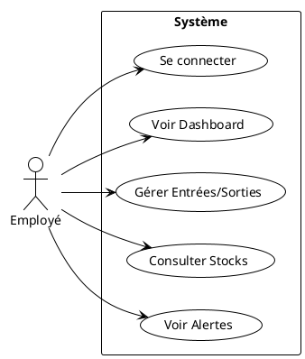
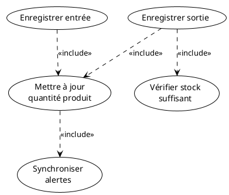

# Système de Gestion de Stock - Diagramme de Cas d'Utilisation

## Vue d'Ensemble du Système

```plantuml
@startuml
!theme plain
skinparam backgroundColor #FEFEFE
skinparam componentStyle rectangle

left to right direction

rectangle "Système de Gestion de Stock" {
    
    package "Authentification" {
        usecase "S'inscrire\n(Créer entreprise)" as UC_Register
        usecase "Se connecter" as UC_Login
        usecase "Se déconnecter" as UC_Logout
        usecase "Voir profil" as UC_Profile
    }
    
    package "Gestion des Produits" {
        usecase "Lister les produits" as UC_ListProducts
        usecase "Créer un produit" as UC_CreateProduct
        usecase "Voir un produit" as UC_ViewProduct
        usecase "Modifier un produit" as UC_UpdateProduct
        usecase "Supprimer un produit" as UC_DeleteProduct
        usecase "Rechercher un produit" as UC_SearchProduct
        usecase "Filtrer par catégorie" as UC_FilterCategory
    }
    
    package "Gestion des Catégories" {
        usecase "Lister les catégories" as UC_ListCategories
        usecase "Créer une catégorie" as UC_CreateCategory
        usecase "Modifier une catégorie" as UC_UpdateCategory
        usecase "Supprimer une catégorie" as UC_DeleteCategory
    }
    
    package "Gestion des Mouvements de Stock" {
        usecase "Enregistrer\nentrée de stock" as UC_StockEntry
        usecase "Enregistrer\nsortie de stock" as UC_StockExit
        usecase "Lister les mouvements" as UC_ListMovements
        usecase "Filtrer les mouvements\n(par date, type, produit)" as UC_FilterMovements
    }
    
    package "Alertes de Stock" {
        usecase "Configurer\nseuil d'alerte" as UC_SetAlert
        usecase "Modifier\nseuil d'alerte" as UC_UpdateAlert
        usecase "Supprimer\nseuil d'alerte" as UC_DeleteAlert
        usecase "Consulter\nalertes actives" as UC_ViewAlerts
        usecase "Recevoir notification\nstock critique" as UC_Notification
    }
    
    package "Rapports & Tableau de Bord" {
        usecase "Voir tableau de bord" as UC_Dashboard
        usecase "Voir état des stocks" as UC_StockStatus
        usecase "Voir stocks faibles" as UC_LowStock
        usecase "Voir historique\ndes mouvements" as UC_MovementHistory
        usecase "Exporter rapports" as UC_Export
        usecase "Voir graphiques\ntendances" as UC_Charts
    }
    
    package "Gestion des Utilisateurs" {
        usecase "Lister les utilisateurs" as UC_ListUsers
        usecase "Créer un utilisateur" as UC_CreateUser
        usecase "Voir un utilisateur" as UC_ViewUser
        usecase "Modifier un utilisateur" as UC_UpdateUser
        usecase "Supprimer un utilisateur" as UC_DeleteUser
    }
    
    package "Gestion des Entreprises" {
        usecase "Lister les entreprises" as UC_ListCompanies
        usecase "Créer une entreprise" as UC_CreateCompany
        usecase "Voir une entreprise" as UC_ViewCompany
        usecase "Modifier une entreprise" as UC_UpdateCompany
        usecase "Changer statut\nentreprise" as UC_UpdateCompanyStatus
        usecase "Supprimer une entreprise" as UC_DeleteCompany
    }
}

' Acteurs
actor "Super Admin" as SuperAdmin #Red
actor "Admin" as Admin #Orange
actor "Employé" as Employee #LightBlue

' Relations - Super Admin (tout le système)
SuperAdmin --> UC_Register
SuperAdmin --> UC_Login
SuperAdmin --> UC_Logout
SuperAdmin --> UC_Profile

SuperAdmin --> UC_ListProducts
SuperAdmin --> UC_CreateProduct
SuperAdmin --> UC_ViewProduct
SuperAdmin --> UC_UpdateProduct
SuperAdmin --> UC_DeleteProduct
SuperAdmin --> UC_SearchProduct
SuperAdmin --> UC_FilterCategory

SuperAdmin --> UC_ListCategories
SuperAdmin --> UC_CreateCategory
SuperAdmin --> UC_UpdateCategory
SuperAdmin --> UC_DeleteCategory

SuperAdmin --> UC_StockEntry
SuperAdmin --> UC_StockExit
SuperAdmin --> UC_ListMovements
SuperAdmin --> UC_FilterMovements

SuperAdmin --> UC_SetAlert
SuperAdmin --> UC_UpdateAlert
SuperAdmin --> UC_DeleteAlert
SuperAdmin --> UC_ViewAlerts
SuperAdmin --> UC_Notification

SuperAdmin --> UC_Dashboard
SuperAdmin --> UC_StockStatus
SuperAdmin --> UC_LowStock
SuperAdmin --> UC_MovementHistory
SuperAdmin --> UC_Export
SuperAdmin --> UC_Charts

SuperAdmin --> UC_ListUsers
SuperAdmin --> UC_CreateUser
SuperAdmin --> UC_ViewUser
SuperAdmin --> UC_UpdateUser
SuperAdmin --> UC_DeleteUser

SuperAdmin --> UC_ListCompanies
SuperAdmin --> UC_CreateCompany
SuperAdmin --> UC_ViewCompany
SuperAdmin --> UC_UpdateCompany
SuperAdmin --> UC_UpdateCompanyStatus
SuperAdmin --> UC_DeleteCompany

' Relations - Admin (pas de gestion des entreprises)
Admin --> UC_Register
Admin --> UC_Login
Admin --> UC_Logout
Admin --> UC_Profile

Admin --> UC_ListProducts
Admin --> UC_CreateProduct
Admin --> UC_ViewProduct
Admin --> UC_UpdateProduct
Admin --> UC_DeleteProduct
Admin --> UC_SearchProduct
Admin --> UC_FilterCategory

Admin --> UC_ListCategories
Admin --> UC_CreateCategory
Admin --> UC_UpdateCategory
Admin --> UC_DeleteCategory

Admin --> UC_StockEntry
Admin --> UC_StockExit
Admin --> UC_ListMovements
Admin --> UC_FilterMovements

Admin --> UC_SetAlert
Admin --> UC_UpdateAlert
Admin --> UC_DeleteAlert
Admin --> UC_ViewAlerts
Admin --> UC_Notification

Admin --> UC_Dashboard
Admin --> UC_StockStatus
Admin --> UC_LowStock
Admin --> UC_MovementHistory
Admin --> UC_Export
Admin --> UC_Charts

Admin --> UC_ListUsers
Admin --> UC_CreateUser
Admin --> UC_ViewUser
Admin --> UC_UpdateUser
Admin --> UC_DeleteUser

' Relations - Employé (lecture seule pour la plupart)
Employee --> UC_Register
Employee --> UC_Login
Employee --> UC_Logout
Employee --> UC_Profile

Employee --> UC_ListProducts
Employee --> UC_ViewProduct
Employee --> UC_SearchProduct
Employee --> UC_FilterCategory

Employee --> UC_ListCategories

Employee --> UC_StockEntry
Employee --> UC_StockExit
Employee --> UC_ListMovements
Employee --> UC_FilterMovements

Employee --> UC_ViewAlerts
Employee --> UC_Notification

Employee --> UC_Dashboard
Employee --> UC_StockStatus
Employee --> UC_LowStock
Employee --> UC_MovementHistory
Employee --> UC_Charts

@enduml
```



---

## Description Détaillée des Cas d'Utilisation

### 1. Authentification

| Cas d'Utilisation | Description | Acteurs |
|-------------------|-------------|---------|
| **S'inscrire (Créer entreprise)** | Création d'un compte entreprise avec admin initial | Super Admin, Admin, Employé |
| **Se connecter** | Authentification avec email/mot de passe | Tous |
| **Se déconnecter** | Déconnexion et révocation du token | Tous |
| **Voir profil** | Consulter les informations de l'utilisateur connecté | Tous |

### 2. Gestion des Produits

| Cas d'Utilisation | Description | Acteurs |
|-------------------|-------------|---------|
| **Lister les produits** | Liste paginée avec catégories et alertes | Tous |
| **Créer un produit** | Ajout d'un nouveau produit avec nom, prix, quantité, catégorie | Admin, Super Admin |
| **Voir un produit** | Détails complets d'un produit | Tous |
| **Modifier un produit** | Mise à jour des informations | Admin, Super Admin |
| **Supprimer un produit** | Suppression définitive | Admin, Super Admin |
| **Rechercher un produit** | Recherche par nom | Tous |
| **Filtrer par catégorie** | Filtre par ID de catégorie | Tous |

### 3. Gestion des Catégories

| Cas d'Utilisation | Description | Acteurs |
|-------------------|-------------|---------|
| **Lister les catégories** | Liste paginée des catégories | Tous |
| **Créer une catégorie** | Ajout d'une nouvelle catégorie | Admin, Super Admin |
| **Modifier une catégorie** | Mise à jour du nom | Admin, Super Admin |
| **Supprimer une catégorie** | Suppression définitive | Admin, Super Admin |

### 4. Gestion des Mouvements de Stock

| Cas d'Utilisation | Description | Acteurs |
|-------------------|-------------|---------|
| **Enregistrer entrée de stock** | Ajout de quantité (avec fournisseur, note, date) | Tous |
| **Enregistrer sortie de stock** | Retrait de quantité (avec raison, note, date) | Tous |
| **Lister les mouvements** | Historique paginé avec produit et utilisateur | Tous |
| **Filtrer les mouvements** | Filtres par date, type (entry/exit), produit | Tous |

**Règles métier importantes:**
- Une sortie de stock vérifie que la quantité demandée ≤ quantité disponible
- Les mouvements sont enregistrés dans une transaction SQL (atomicité)
- Après chaque mouvement, les alertes sont synchronisées

### 5. Alertes de Stock

| Cas d'Utilisation | Description | Acteurs |
|-------------------|-------------|---------|
| **Configurer seuil d'alerte** | Définir un seuil minimum pour un produit | Admin, Super Admin |
| **Modifier seuil d'alerte** | Mise à jour du seuil | Admin, Super Admin |
| **Supprimer seuil d'alerte** | Suppression de l'alerte | Admin, Super Admin |
| **Consulter alertes actives** | Liste des produits sous le seuil | Tous |
| **Recevoir notification** | Log ou email quand seuil atteint | Automatique |

### 6. Rapports & Tableau de Bord

| Cas d'Utilisation | Description | Acteurs |
|-------------------|-------------|---------|
| **Voir tableau de bord** | KPIs : total produits, valeur stock, alertes, ruptures | Tous |
| **Voir état des stocks** | Liste avec statut (ok/low/out) | Tous |
| **Voir stocks faibles** | Liste filtrée des produits en alerte | Tous |
| **Voir historique mouvements** | Historique complet avec filtres | Tous |
| **Exporter rapports** | Export des données (endpoint disponible) | Tous |
| **Voir graphiques tendances** | Courbes des entrées/sorties sur 7 jours | Tous |

**KPIs du tableau de bord:**
- `total_products` : Nombre total de produits
- `valeur_totale` : Σ(quantité × prix) de tous les produits
- `alertes_count` : Nombre de produits sous seuil d'alerte
- `out_of_stock_count` : Nombre de produits en rupture (quantité = 0)
- `recent_movements` : 10 derniers mouvements
- `chart` : Données pour graphique des 7 derniers jours

### 7. Gestion des Utilisateurs (Admin uniquement)

| Cas d'Utilisation | Description | Acteurs |
|-------------------|-------------|---------|
| **Lister les utilisateurs** | Liste paginée avec recherche | Admin, Super Admin |
| **Créer un utilisateur** | Ajout d'un employé ou admin | Admin, Super Admin |
| **Voir un utilisateur** | Détails d'un utilisateur | Admin, Super Admin |
| **Modifier un utilisateur** | Mise à jour (nom, email, rôle, mot de passe) | Admin, Super Admin |
| **Supprimer un utilisateur** | Suppression définitive | Admin, Super Admin |

**Rôles disponibles:**
- `super_admin` : Accès total y compris gestion des entreprises
- `admin` : Gestion complète sauf entreprises
- `employee` : Gestion des mouvements et lecture seule

### 8. Gestion des Entreprises (Super Admin uniquement)

| Cas d'Utilisation | Description | Acteurs |
|-------------------|-------------|---------|
| **Lister les entreprises** | Liste avec compteurs (users, products) | Super Admin |
| **Créer une entreprise** | Création entreprise + admin initial | Super Admin |
| **Voir une entreprise** | Détails avec relations | Super Admin |
| **Modifier une entreprise** | Mise à jour des informations | Super Admin |
| **Changer statut entreprise** | Activer/Désactiver | Super Admin |
| **Supprimer une entreprise** | Suppression avec cascade (users, products, etc.) | Super Admin |

---

## Diagramme de Cas d'Utilisation Simplifié (Vue Employé)



---

## Flux de Données Principaux

### Flux 1: Création d'un Mouvement de Stock (Entrée)
```
1. Utilisateur → POST /api/stock-movements
   Body: { product_id, type: "entry", quantity, date, supplier, note }

2. Système → Validation des données

3. Système → BEGIN TRANSACTION
   a. SELECT * FROM products WHERE id_product = ? FOR UPDATE
   b. UPDATE products SET quantite = quantite + ? WHERE id_product = ?
   c. INSERT INTO stock_movements (...)
   d. CALL AlerteStockSync::afterQuantityChange(product)
   COMMIT

4. Système → Réponse JSON avec mouvement créé
```

### Flux 2: Création d'un Mouvement de Stock (Sortie)
```
1. Utilisateur → POST /api/stock-movements
   Body: { product_id, type: "exit", quantity, date, reason, note }

2. Système → Validation des données

3. Système → Vérification: quantité demandée ≤ quantité disponible ?
   Si NON → Erreur 422 "Stock insuffisant"

4. Système → BEGIN TRANSACTION
   a. SELECT * FROM products WHERE id_product = ? FOR UPDATE
   b. UPDATE products SET quantite = quantite - ? WHERE id_product = ?
   c. INSERT INTO stock_movements (...)
   d. CALL AlerteStockSync::afterQuantityChange(product)
   COMMIT

5. Système → Réponse JSON avec mouvement créé
```

---

## Relations Entre Cas d'Utilisation



---

## Endpoints API par Cas d'Utilisation

| Cas d'Utilisation | Méthode | Endpoint | Middleware |
|-------------------|---------|----------|------------|
| S'inscrire | POST | `/api/register` | Public |
| Se connecter | POST | `/api/login` | Public |
| Se déconnecter | POST | `/api/logout` | Auth |
| Voir profil | GET | `/api/me` | Auth |
| Lister produits | GET | `/api/products` | Auth |
| Créer produit | POST | `/api/products` | Auth |
| Voir produit | GET | `/api/products/{id}` | Auth |
| Modifier produit | PUT | `/api/products/{id}` | Auth |
| Supprimer produit | DELETE | `/api/products/{id}` | Auth |
| Lister catégories | GET | `/api/categories` | Auth |
| Créer catégorie | POST | `/api/categories` | Auth + Admin |
| Modifier catégorie | PUT | `/api/categories/{id}` | Auth + Admin |
| Supprimer catégorie | DELETE | `/api/categories/{id}` | Auth + Admin |
| Lister mouvements | GET | `/api/stock-movements` | Auth |
| Créer mouvement | POST | `/api/stock-movements` | Auth |
| Lister alertes | GET | `/api/alertes` | Auth + Admin |
| Créer alerte | POST | `/api/alertes` | Auth + Admin |
| Modifier alerte | PUT | `/api/alertes/{id}` | Auth + Admin |
| Supprimer alerte | DELETE | `/api/alertes/{id}` | Auth + Admin |
| Dashboard | GET | `/api/reports/dashboard` | Auth |
| État des stocks | GET | `/api/reports/stock-status` | Auth |
| Stocks faibles | GET | `/api/reports/low-stock` | Auth |
| Historique mouvements | GET | `/api/reports/movement-history` | Auth |
| Lister utilisateurs | GET | `/api/users` | Auth + Admin |
| Créer utilisateur | POST | `/api/users` | Auth + Admin |
| Voir utilisateur | GET | `/api/users/{id}` | Auth + Admin |
| Modifier utilisateur | PUT | `/api/users/{id}` | Auth + Admin |
| Supprimer utilisateur | DELETE | `/api/users/{id}` | Auth + Admin |
| Lister entreprises | GET | `/api/companies` | Auth + Super Admin |
| Créer entreprise | POST | `/api/companies` | Auth + Super Admin |
| Voir entreprise | GET | `/api/companies/{id}` | Auth + Super Admin |
| Modifier entreprise | PUT | `/api/companies/{id}` | Auth + Super Admin |
| Changer statut | PATCH | `/api/companies/{id}/statut` | Auth + Super Admin |
| Supprimer entreprise | DELETE | `/api/companies/{id}` | Auth + Super Admin |
